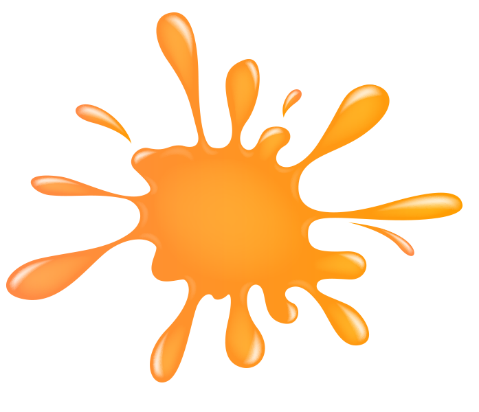
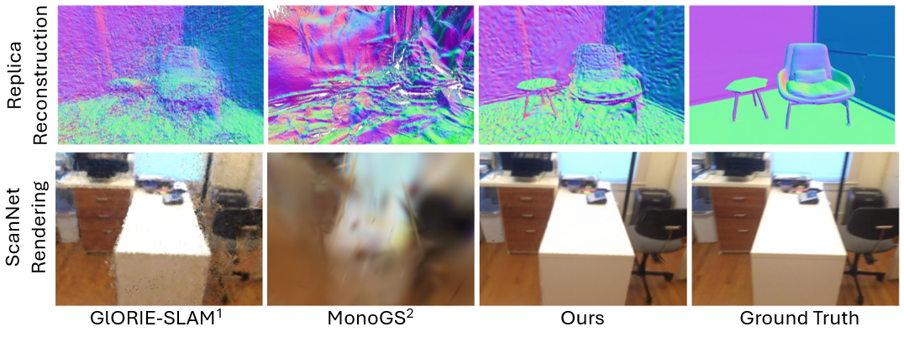
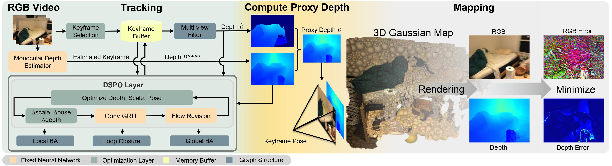

<!-- PROJECT LOGO -->
  <h1 align="center">Splat-SLAM: Globally Optimized RGB-only SLAM with 3D Gaussians</h1>
  <p align="center">
    <a href="https://eriksandstroem.github.io/" target="_blank"><strong>Erik Sandström<sup>1,2*</sup></strong></a>
    ·
    <a><strong>Keisuke Tateno<sup>2</sup></strong></a>
    ·
    <a href="https://moechsle.github.io/" target="_blank"><strong>Michael Oechsle<sup>2</sup></strong></a>
     ·
    <a href="https://m-niemeyer.github.io/" target="_blank"><strong>Michael Niemeyer<sup>2</sup></strong></a>
    <br>
    <a href="https://vision.ee.ethz.ch/people-details.OTAyMzM=.TGlzdC8zMjg3LC0xOTcxNDY1MTc4.html" target="_blank"><strong>Luc Van Gool<sup>1,4,5</sup></strong></a>
    ·
    <a href="https://cvg.ethz.ch/team/Dr-Martin-R-Oswald" target="_blank"><strong>Martin R. Oswald<sup>1,6</sup></strong></a>
    ·
    <a href="https://federicotombari.github.io/" target="_blank"><strong>Federico Tombari<sup>2,3</sup></strong></a>
  </p>
  <p align="center">
      <strong><sup>1 </sup>ETH Zurich,  <sup>2 </sup>Google, <sup>3 </sup>TUM, <sup>4 </sup>KU Leuven, <sup>5 </sup>INSAIT, <sup>6 </sup>University of Amsterdam </strong>
      <br>(<strong>*</strong> This work was conducted during an internship at Google)
      <strong><h4 align="center"><a href="https://arxiv.org/abs/2405.16544" target="_blank">Paper</a></h4></strong>
  </p>


<p align="center">
This is not an officially endorsed Google product.
</p>


<p align="center">
    
</p>

<p align="center">
<strong>Splat-SLAM</strong> produces more accurate dense geometry and rendering results compared to existing methods. This is thanks to our <strong> deformable 3DGS representation </strong> and <strong>DSPO layer</strong> for camera pose and depth estimation. <sup>1</sup>Zhang et al. 2024. <sup>2</sup>Matsuki et al. 2023.
</p>

<p align="center">
    
</p>
<p align="center">
<strong>Splat-SLAM Architecture</strong>. We use a keyframe based frame to frame tracker based on dense optical flow connected to a pose graph for global consistency. For dense mapping, we resort to a 3DGS representation, suitable for extracting both dense geometry and rendering from. 
</p>

<!-- TABLE OF CONTENTS -->
<details open="open" style='padding: 10px; border-radius:5px 30px 30px 5px; border-style: solid; border-width: 1px;'>
  <summary>Table of Contents</summary>
  <ol>
    <li>
      <a href="#installation">Installation</a>
    </li>
    <li>
      <a href="#run">Run</a>
    </li>
    <li>
      <a href="#acknowledgement">Acknowledgement</a>
    </li>
    <li>
      <a href="#citation">Citation</a>
    </li>
    <li>
      <a href="#contact">Contact</a>
    </li>
  </ol>
</details>


## Installation
1. Clone the repo using the `--recursive` flag 
```bash
git clone --recursive https://github.com/google-research/Splat-SLAM.git
cd Splat-SLAM
```
2. Creating a new conda environment. 
```bash
conda create --name splat-slam python=3.10
conda activate splat-slam
```
3. Install CUDA 11.7 using conda and pytorch 1.12
```bash
conda install conda-forge::cudatoolkit-dev=11.7.0
conda install pytorch torchvision torchaudio pytorch-cuda=11.8 -c pytorch -c nvidia
```
> Now make sure that "which python" points to the correct python
executable. Also test that cuda is available
python -c "import torch; print(torch.cuda.is_available())"

4. Update depth rendering hyperparameter in thirparty library
  > By default, the gaussian rasterizer does not render gaussians that are closer than 0.2 (meters) in front of the camera. In our monocular setting, where the global scale is ambiguous, this can lead to issues during rendering. Therefore, we adjust this threshold to 0.001 instead of 0.2. Change the value at [this](https://github.com/rmurai0610/diff-gaussian-rasterization-w-pose/blob/43e21bff91cd24986ee3dd52fe0bb06952e50ec7/cuda_rasterizer/auxiliary.h#L154) line, i.e. it should read
```bash
if (p_view.z <= 0.001f)// || ((p_proj.x < -1.3 || p_proj.x > 1.3 || p_proj.y < -1.3 || p_proj.y > 1.3)))
```
5. Install the remaining dependencies.
```bash
python -m pip install -e thirdparty/lietorch/
python -m pip install -e thirdparty/diff-gaussian-rasterization-w-pose/
python -m pip install -e thirdparty/simple-knn/
python -m pip install -e thirdparty/evaluate_3d_reconstruction_lib/
```

6. Check installation.
```bash
python -c "import torch; import lietorch; import simple_knn; import
diff_gaussian_rasterization; print(torch.cuda.is_available())"
```

7. Now install the droid backends and the other requirements
```bash
python -m pip install -e .
python -m pip install -r requirements.txt
python -m pip install pytorch-lightning==1.9 --no-deps
```

8. Download pretrained model.
Download the pretained models from [Google Drive](https://drive.google.com/file/d/1oZbVPrubtaIUjRRuT8F-YjjHBW-1spKT/view?usp=drive_link), unzip them inside the `pretrained` folder. The `middle_fine.pt` decoder will not be used and can be removed.
<details>
  <summary>[Directory structure of pretrained (click to expand)]</summary>
  
```bash
  .
  └── pretrained
        ├── .gitkeep
        ├── droid.pth
        ├── middle_fine.pt
        └── omnidata_dpt_depth_v2.ckpt

```
</details>


## Data Download

### Replica
Download the data as below and the data is saved into the `./datasets/Replica` folder. Note that the Replica data is generated by the authors of iMAP (but hosted by the authors of NICE-SLAM). Please cite iMAP if you use the data.
```bash
bash scripts/download_replica.sh
```
To be able to evaluate the reconstruction error, download the ground truth Replica meshes where unseen region have been culled.

```bash
bash scripts/download_cull_replica_mesh.sh
```

### TUM-RGBD
```bash
bash scripts/download_tum.sh
```
Please change the `input_folder` path in the scene specific config files to point to where the data is stored.


### ScanNet
Please follow the data downloading procedure on the [ScanNet](http://www.scan-net.org/) website, and extract color/depth frames from the `.sens` file using this [code](https://github.com/ScanNet/ScanNet/blob/master/SensReader/python/reader.py).

<details>
  <summary>[Directory structure of ScanNet (click to expand)]</summary>
  
  Please change the `input_folder` path in the scene specific config files to point to where the data is stored.

```
  DATAROOT
  └── scannet
        └── scene0000_00
            └── frames
                ├── color
                │   ├── 0.jpg
                │   ├── 1.jpg
                │   ├── ...
                │   └── ...
                ├── depth
                │   ├── 0.png
                │   ├── 1.png
                │   ├── ...
                │   └── ...
                ├── intrinsic
                └── pose
                    ├── 0.txt
                    ├── 1.txt
                    ├── ...
                    └── ...
```
</details>


We use the following sequences: 
```
scene0000_00
scene0054_00
scene0059_00
scene0106_00
scene0169_00
scene0181_00
scene0207_00
scene0233_00
```

## Run
For running Splat-SLAM, each scene has a config folder, where the `input_folder`,`output` paths need to be specified. Below, we show some example run commands for one scene from each dataset.

### Replica
To run Splat-SLAM on the `office0` scene, run the following command. 
```bash
python run.py configs/Replica/office0.yaml
```
After reconstruction, the trajectory error will be evaluated and so will the mesh accuracy along with the rendering metrics.

### TUM-RGBD
To run Splat-SLAM on the `freiburg3_office` scene, run the following command. 
```bash
python run.py configs/TUM_RGBD/freiburg3_office.yaml
```
After reconstruction, the trajectory error will be evaluated automatically.

### ScanNet

To run Splat-SLAM on the `scene0000_00` scene, run the following command. 
```bash
python run.py configs/Scannet/scene0000.yaml
```
After reconstruction, the trajectory error will be evaluated automatically.

## Run tracking without mapping
Our Splat-SLAM pipeline uses two processes, one for tracking and one for mapping, and it is possible to run tracking only without mapping/rendering. Add `--only_tracking` in each of the above commands.
```bash
python run.py configs/Replica/office0.yaml --only_tracking
python run.py configs/TUM_RGBD/freiburg3_office.yaml --only_tracking
python run.py configs/Scannet/scene0000.yaml --only_tracking
```

## Acknowledgement
Our codebase is partially based on [GlORIE-SLAM](https://github.com/zhangganlin/GlORIE-SLAM), [GO-SLAM](https://github.com/youmi-zym/GO-SLAM), [DROID-SLAM](https://github.com/princeton-vl/DROID-SLAM) and [MonoGS](https://github.com/muskie82/MonoGS). We thank the authors for making these codebases publicly available. Our work would not have been possible without your great efforts!

## Reproducibility
There may be minor differences between the released codebase and the results reported in the paper. Further, we note that the GPU hardware has an influence, despite running the same seed and conda environment.

## Citation

If you find our code or paper useful, please cite
```bibtex
@article{sandstrom2024splat,
  title={Splat-SLAM: Globally Optimized RGB-only SLAM with 3D Gaussians},
  author={Sandstr{\"o}m, Erik and Tateno, Keisuke and Oechsle, Michael and Niemeyer, Michael and Van Gool, Luc and Oswald, Martin R and Tombari, Federico},
  journal={arXiv preprint arXiv:2405.16544},
  year={2024}
}
```
## Contact
Contact [Erik Sandström](mailto:erik.sandstrm@gmail.com) for questions, comments and reporting bugs.

